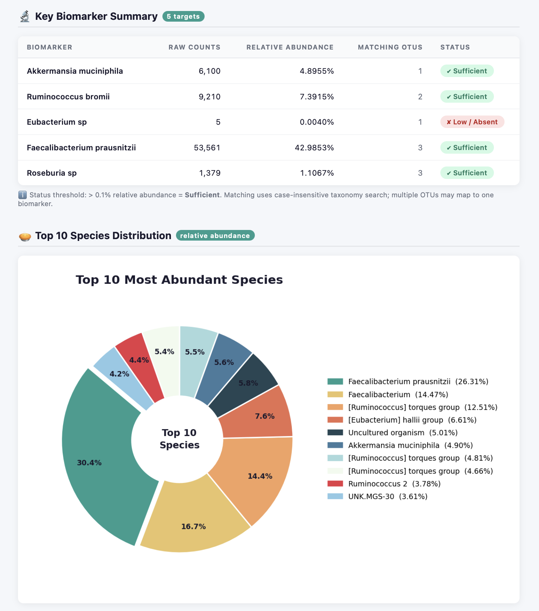

# Microbiome Biomarker Analyzer

## Project Overview
Most people who take a gut microbiome test receive a confusing, massive spreadsheet (an OTU table) filled with complex bacterial names and raw numbers. To a regular person, this data is completely unreadable. 

This project is an automated data pipeline designed to bridge that gap. It takes raw, technical microbiome data and transforms it into a clean, easy-to-understand **HTML visual report designed for everyday users (patients, biohackers, or health enthusiasts)**. The tool simplifies the science, providing clear visual insights into their gut health without requiring a background in biology.

## Core Features
1. **Raw Data Translation:** Converts technical OTU tables (CSV format) into user-friendly insights.
2. **Relative Abundance Made Simple:** Translates raw bacterial sequence counts into clear percentages so users know exactly what ratio of their gut is made up of which bacteria.
3. **Personalized Biomarker Screening:** Scans the sample for critical bacteria that impact daily health and flags them using intuitive visual cues.
4. **Consumer-Friendly Dashboard:** Generates a standalone, beautifully structured `report.html` file that reads like a commercial health report rather than a laboratory printout.



## Tracked Bacterial Markers (Examples for Proof of Concept)
The pipeline is built with a modular architecture, meaning it can easily expand to track any bacterial profile. For the initial **Proof of Concept (POC)**, the system is pre-configured to detect and explain a representative list of key bacteria known to heavily influence overall wellness:

* *Akkermansia muciniphila* (Example of a marker linked to metabolic health and a strong gut lining)
* *Ruminococcus bromii* (Example of a major helper in breaking down dietary starches and fibers)
* *Eubacterium sp.* (Example of a genus important for producing beneficial gut compounds)
* *Faecalibacterium prausnitzii* (Example of a core anti-inflammatory gut bacterium)
* *Roseburia sp.* (Example of a key short-chain fatty acid producer vital for gut energy)

*Note: This specific list serves as an initial showcase profile to demonstrate the system's filtering and customer-facing explanation capabilities. It will be expanded to support broader health panels in future versions.*

---

## Technical Architecture & Dependencies
The pipeline is entirely built using **Python 3.x** and relies on the following standard data libraries:
* `pandas` - For reading the input data, filtering target species, and sorting percentages.
* `matplotlib` or `plotly` - For generating accessible visualizations (e.g., Top 10 Most Abundant Bacteria Pie Charts).
* `jinja2` (or Python native f-strings) - For rendering the dynamic health data into an elegant, non-technical HTML layout.

### Expected Input Format
The application expects a standard **CSV file** generated from sequencing pipelines, structured with taxonomic identifiers and abundance counts:
```csv
Taxonomy,Counts
"k__Bacteria;p__Verrucomicrobia;g__Akkermansia;s__muciniphila",1420
"k__Bacteria;p__Firmicutes;g__Faecalibacterium;s__prausnitzii",3850
...